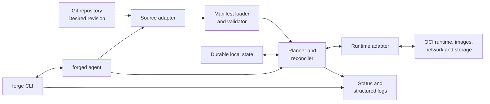

# Architecture

## Context

Forge sits between a Git repository and one Linux host's container runtime. It
is a reconciliation engine, not a replacement for the Linux kernel or an OCI
runtime implementation.

## Components

### `forge` CLI

The CLI is the operator interface for validation, plan, explicit apply, status,
logs, rollback, and version information. Read-only commands may query state
concurrently. Mutating commands must coordinate with the agent through the same
host-wide lock and reconciliation service.

### `forged` agent

The agent owns the periodic reconciliation loop. It resolves the configured Git
reference, triggers a reconciliation when the immutable commit changes or drift
is detected, applies bounded retry, and exposes local operational status.

### Source adapter

The source adapter retrieves Git data and returns content from one immutable
commit. Authentication remains outside manifests. The rest of the engine never
reads a mutable branch name after resolution.

### Manifest loader and validator

This component parses one explicitly versioned schema, applies defaults, rejects
unknown fields, checks host-safety constraints, and creates a canonical desired
model. Runtime calls are forbidden during parsing.

### Planner and reconciler

The planner compares canonical desired state, runtime observations, and the last
applied record. It emits a deterministic ordered plan. The reconciler prepares
all artifacts, takes the mutation lock, executes actions, verifies results, and
records the outcome.

### Runtime adapter

The adapter exposes only the operations Forge requires: resolve and prepare an
image, inspect resources, create or replace a container, start, stop, remove,
read logs, and return normalized errors. Runtime-specific IDs and configuration
must not leak into the desired-state model.

OCI compatibility defines artifact and execution boundaries, but OCI alone does
not specify host networking, storage, lifecycle policy, or image transport. The
first adapter must therefore document its additional contract explicitly.

### Durable local state

The state store records immutable revision IDs, canonical desired-state hashes,
observations needed for recovery, operation journals, and last successful state.
It is not the desired-state authority. The backend remains undecided, but writes
must be atomic at the record level and schema migrations must be explicit.

## State model

Forge distinguishes five states:

- **configured revision:** the mutable Git reference selected by the operator;
- **desired revision:** the immutable commit currently being evaluated;
- **last attempted revision:** the commit of the latest started operation;
- **last successful revision:** the most recent fully verified commit;
- **observed state:** what the runtime reports now.

`converged` means observed state matches the canonical desired model for the
desired commit. It never means merely that an apply command returned zero.

## Concurrency and recovery

Only one mutating reconciliation may run on a host. The mutation lock must
survive process coordination but not create a permanent deadlock after a crash.
Every action records intent before execution and observation after execution.
After interruption, Forge observes the runtime and calculates a new plan instead
of replaying an assumed remainder.

## Failure and rollback

Manifest validation and artifact preparation occur before mutation. Runtime
operations remain sequential and non-transactional. On partial failure, Forge
stops, observes, records, and reports the exact boundary reached.

Rollback is a normal reconciliation toward a previously successful immutable
revision. It is best effort and subject to artifact availability and irreversible
external effects. Forge must never label a partially restored workload healthy.

## Security boundaries

Git content is untrusted input with the potential to request privileged host
operations. The validator, agent privileges, runtime socket, local state, and
logs are separate trust boundaries. The detailed initial model lives in
[`SECURITY.md`](../SECURITY.md).

## Deferred architecture

There is no distributed control plane, host registry, scheduler, plugin system,
web API, or cross-platform abstraction in the MVP. Extension seams are justified
only where they protect an already required boundary: source, state, and runtime.
